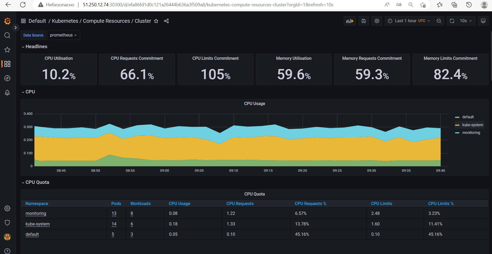
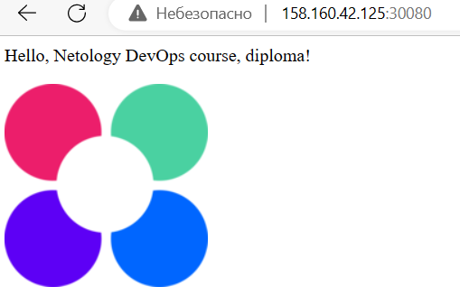
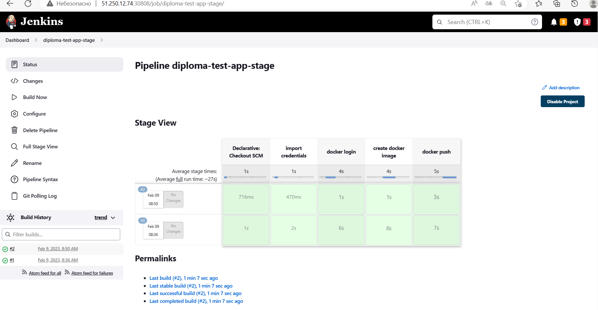
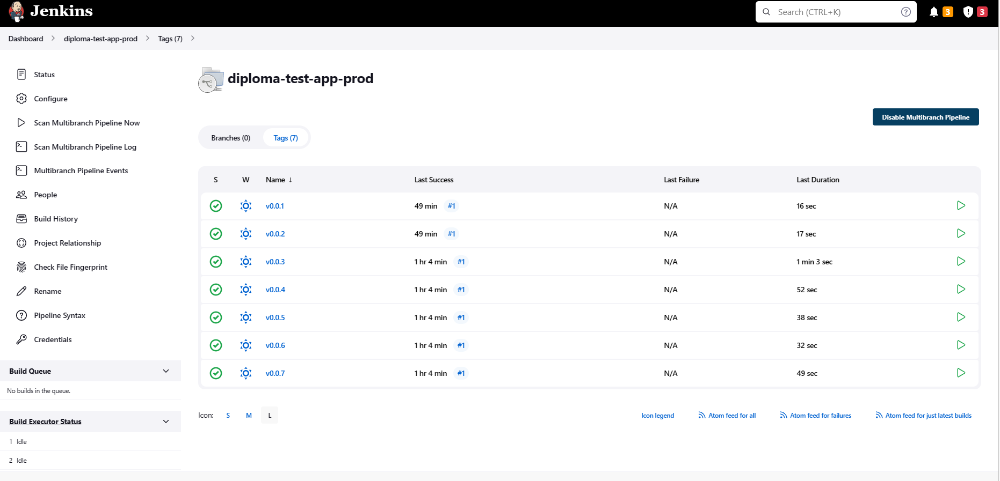
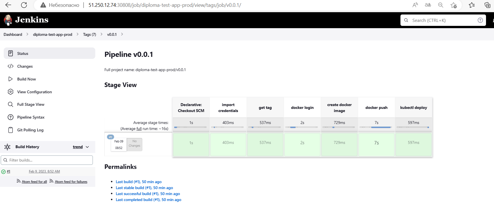
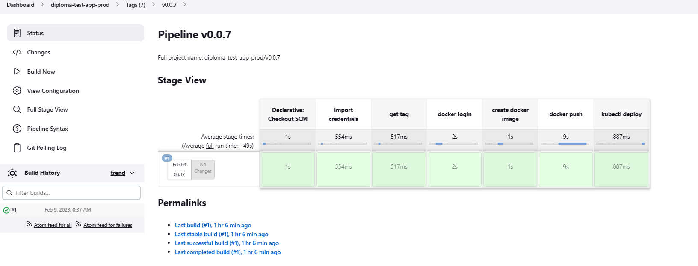

# Диплом

>  * [Цели:](#цели)
>  * [Как правильно задавать вопросы дипломному руководителю?](#как-правильно-задавать-вопросы-дипломному-руководителю)
>  * [Что необходимо для сдачи задания?](#что-необходимо-для-сдачи-задания)
>  * [Этапы выполнения:](#этапы-выполнения)
>     * [Создание облачной инфраструктуры](#создание-облачной-инфраструктуры)
>     * [Создание Kubernetes кластера](#создание-kubernetes-кластера)
>     * [Создание тестового приложения](#создание-тестового-приложения)
>     * [Подготовка cистемы мониторинга и деплой приложения](#подготовка-cистемы-мониторинга-и-деплой-приложения)
>     * [Установка и настройка CI/CD](#установка-и-настройка-cicd)

Как правильно задавать вопросы дипломному руководителю?

## Как правильно задавать вопросы дипломному руководителю?

> Что поможет решить большинство частых проблем:
> 
> 1. Попробовать найти ответ сначала самостоятельно в интернете или в материалах курса и ДЗ и только после этого спрашивать у дипломного руководителя. Скилл поиска ответов пригодится вам в профессиональной деятельности.
> 2. Если вопросов больше одного, то присылайте их в виде нумерованного списка. Так дипломному руководителю будет проще отвечать на каждый из них.
> 3. При необходимости прикрепите к вопросу скриншоты и стрелочкой покажите, где не получается.
> 
> Что может стать источником проблем:
> 
> 1. Вопросы вида «Ничего не работает. Не запускается. Всё сломалось». Дипломный руководитель не сможет ответить на такой вопрос без дополнительных уточнений. Цените своё время и время других.
> 2. Откладывание выполнения курсового проекта на последний момент.
> 3. Ожидание моментального ответа на свой вопрос. Дипломные руководители работающие разработчики, которые занимаются, кроме преподавания, своими проектами. Их время ограничено, поэтому постарайтесь задавать правильные вопросы, чтобы получать быстрые ответы :)

---
## Цели

> 1. Подготовить облачную инфраструктуру на базе облачного провайдера Яндекс.Облако.
> 2. Запустить и сконфигурировать Kubernetes кластер.
> 3. Установить и настроить систему мониторинга.
> 4. Настроить и автоматизировать сборку тестового приложения с использованием Docker-контейнеров.
> 5. Настроить CI для автоматической сборки и тестирования.
> 6. Настроить CD для автоматического развёртывания приложения.

---
## Что необходимо для сдачи задания?

> 1. Репозиторий с конфигурационными файлами Terraform и готовность продемонстрировать создание всех ресурсов с нуля.

[Репозиторий](https://github.com/pavelmm/diploma-terraform)

> 3. Репозиторий с конфигурацией ansible, если был выбран способ создания Kubernetes кластера при помощи ansible.

Использовал Kubespray, который [разворачиваю терафомом](./02/01-yandex/40-k8s.tf). Вся конфигурация [из шаблонов](./02/01-yandex/00-prepare.tf#L19-L27), сгенерировал только файлы инвентаризации и [один файл](./02/01-yandex/kubespray/inventory/diplomacluster/group_vars/k8s_cluster/k8s-cluster.yml#L279) с переменными для доступа в кластер по внешнему IP

[Ссылка на конфигурацию](./02/01-yandex/kubespray/inventory/diplomacluster)

> 4. Репозиторий с Dockerfile тестового приложения и ссылка на собранный docker image.

[Репозиторий](https://github.com/pavelmm/diploma-test-app)

[DockerHub](https://hub.docker.com/repository/docker/pavelmm/diploma-test-app)

> 5. Репозиторий с конфигурацией Kubernetes кластера.

Все сервисы так же разворачиваются при применении конфигурации Terraform:
- [Terraform/Тестовое приложение](./02/01-yandex/60-app.tf)
- [Terraform/Atlantis](./02/01-yandex/70-atlantis.tf)
- [Terraform/Jenkins](./02/01-yandex/80-jenkins.tf)

Некоторые манифесты для Kubernetes геренируются из [шаблонов](./02/01-yandex/templates/), т.к. часть данных в них параметризируются, например IP-адреса для сервисов.

 Получившиеся манифесты:
- [Тестовое приложение](./02/02-app/manifests)
- [Service и NetworkPolicy](./02/03-monitoring/grafana-nodeport) для доступа к Grafana извне; воспользовался [kube-prometheus](https://github.com/prometheus-operator/kube-prometheus), который [разворачиваю с Teraform](./02/01-yandex/50-monitoring.tf) 
- [Atlantis](./02/04-atlantis/manifests)
- [Jenkins](./02/05-jenkins/manifests); Jenkins разворачивается сразу с заданиями, которые [разворачиваются](./02/01-yandex/80-jenkins.tf) Тераформом из шаблонов

> 6. Ссылка на тестовое приложение и веб интерфейс Grafana с данными доступа.

- [Приложение](http://51.250.12.74:30080/)
- [Grafana](http://51.250.12.74:30300/login)
    - Логин `admin`
    - Пароль `admin`
- [Jenkins](http://51.250.12.74:30808/)

---
## Этапы выполнения

### Создание облачной инфраструктуры

Задание

> Для начала необходимо подготовить облачную инфраструктуру в ЯО при помощи [Terraform](https://www.terraform.io/).
> 
> Особенности выполнения:
> 
> - Бюджет купона ограничен, что следует иметь в виду при проектировании инфраструктуры и использовании ресурсов;
> - Следует использовать последнюю стабильную версию [Terraform](https://www.terraform.io/).
> 
> Предварительная подготовка к установке и запуску Kubernetes кластера.
> 
> 1. Создайте сервисный аккаунт, который будет в дальнейшем использоваться Terraform для работы с инфраструктурой с необходимыми и достаточными правами. Не стоит использовать права суперпользователя
> 2. Подготовьте [backend](https://www.terraform.io/docs/language/settings/backends/index.html) для Terraform:  
>    а. Рекомендуемый вариант: [Terraform Cloud](https://app.terraform.io/)  
>    б. Альтернативный вариант: S3 bucket в созданном ЯО аккаунте
> 3. Настройте [workspaces](https://www.terraform.io/docs/language/state/workspaces.html)  
>    а. Рекомендуемый вариант: создайте два workspace: *stage* и *prod*. В случае выбора этого варианта все последующие шаги должны учитывать факт существования нескольких workspace.  
>    б. Альтернативный вариант: используйте один workspace, назвав его *stage*. Пожалуйста, не используйте workspace, создаваемый Terraform-ом по-умолчанию (*default*).
> 4. Создайте VPC с подсетями в разных зонах доступности.
> 5. Убедитесь, что теперь вы можете выполнить команды `terraform destroy` и `terraform apply` без дополнительных ручных действий.
> 6. В случае использования [Terraform Cloud](https://app.terraform.io/) в качестве [backend](https://www.terraform.io/docs/language/settings/backends/index.html) убедитесь, что применение изменений успешно проходит, используя web-интерфейс Terraform cloud.
> 

> Ожидаемые результаты:
> 
> 1. Terraform сконфигурирован и создание инфраструктуры посредством Terraform возможно без дополнительных ручных действий.
> 2. Полученная конфигурация инфраструктуры является предварительной, поэтому в ходе дальнейшего выполнения задания возможны изменения.

- Сеть

    

- ВМ

    

---
### Создание Kubernetes кластера

Задание

> На этом этапе необходимо создать [Kubernetes](https://kubernetes.io/ru/docs/concepts/overview/what-is-kubernetes/) кластер на базе предварительно созданной инфраструктуры.   Требуется обеспечить доступ к ресурсам из Интернета.
> 
> Это можно сделать двумя способами:
> 
> 1. Рекомендуемый вариант: самостоятельная установка Kubernetes кластера.  
>   а. При помощи Terraform подготовить как минимум 3 виртуальных машины Compute Cloud для создания Kubernetes-кластера. Тип виртуальной машины следует выбрать самостоятельно с учётом требовании к производительности и стоимости. Если в дальнейшем поймете, что необходимо сменить тип инстанса, используйте Terraform для внесения изменений.  
>   б. Подготовить [ansible](https://www.ansible.com/) конфигурации, можно воспользоваться, например [Kubespray](https://kubernetes.io/docs/setup/production-environment/tools/kubespray/)  
>   в. Задеплоить Kubernetes на подготовленные ранее инстансы, в случае нехватки каких-либо ресурсов вы всегда можете создать их при помощи Terraform.
> 2. Альтернативный вариант: воспользуйтесь сервисом [Yandex Managed Service for Kubernetes](https://cloud.yandex.ru/services/managed-kubernetes)  
>   а. С помощью terraform resource для [kubernetes](https://registry.terraform.io/providers/yandex-cloud/yandex/latest/docs/resources/kubernetes_cluster) создать региональный мастер kubernetes с размещением нод в разных 3 подсетях      
>   б. С помощью terraform resource для [kubernetes node group](https://registry.terraform.io/providers/yandex-cloud/yandex/latest/docs/resources/kubernetes_node_group)

> Ожидаемый результат:
> 
> 1. Работоспособный Kubernetes кластер.
> 2. В файле `~/.kube/config` находятся данные для доступа к кластеру.
> 3. Команда `kubectl get pods --all-namespaces` отрабатывает без ошибок.

`config` сохранил в отдельную папку, т.к. их два - для воркспейса `stage` и воркспейса `prod`

- `kubectl` для кластера `prod` с флагом `--all-namespaces`

    

- Сравнение вывода списка подов для неймспейса `default` воркспейсов `prod` и `stage`

    

---
### Создание тестового приложения

Задание

> Для перехода к следующему этапу необходимо подготовить тестовое приложение, эмулирующее основное приложение разрабатываемое вашей компанией.
> 
> Способ подготовки:
> 
> 1. Рекомендуемый вариант:  
>    а. Создайте отдельный git репозиторий с простым nginx конфигом, который будет отдавать статические данные.  
>    б. Подготовьте Dockerfile для создания образа приложения.  
> 2. Альтернативный вариант:  
>    а. Используйте любой другой код, главное, чтобы был самостоятельно создан Dockerfile.

> Ожидаемый результат:
> 1. Git репозиторий с тестовым приложением и Dockerfile.
> 2. Регистр с собранным docker image. В качестве регистра может быть DockerHub или [Yandex Container Registry](https://cloud.yandex.ru/services/container-registry), созданный также с помощью terraform.

[Репозиторий](https://github.com/pavelmm/diploma-test-app)

[DockerHub](https://hub.docker.com/repository/docker/runout/diploma-test-app)

---
### Подготовка cистемы мониторинга и деплой приложения

Задание

> Уже должны быть готовы конфигурации для автоматического создания облачной инфраструктуры и поднятия Kubernetes кластера.  
> Теперь необходимо подготовить конфигурационные файлы для настройки нашего Kubernetes кластера.
> 
> Цель:
> 1. Задеплоить в кластер [prometheus](https://prometheus.io/), [grafana](https://grafana.com/), [alertmanager](https://github.com/prometheus/alertmanager), [экспортер](https://github.com/prometheus/node_exporter) основных метрик Kubernetes.
> 2. Задеплоить тестовое приложение, например, [nginx](https://www.nginx.com/) сервер отдающий статическую страницу.
> 
> Рекомендуемый способ выполнения:
> 1. Воспользовать пакетом [kube-prometheus](https://github.com/prometheus-operator/kube-prometheus), который уже включает в себя [Kubernetes оператор](https://operatorhub.io/) для [grafana](https://grafana.com/), [prometheus](https://prometheus.io/), [alertmanager](https://github.com/prometheus/alertmanager) и [node_exporter](https://github.com/prometheus/node_exporter). При желании можете собрать все эти приложения отдельно.
> 2. Для организации конфигурации использовать [qbec](https://qbec.io/), основанный на [jsonnet](https://jsonnet.org/). Обратите внимание на имеющиеся функции для интеграции helm конфигов и [helm charts](https://helm.sh/)
> 3. Если на первом этапе вы не воспользовались [Terraform Cloud](https://app.terraform.io/), то задеплойте в кластер [atlantis](https://www.runatlantis.io/) для отслеживания изменений инфраструктуры.
> 
> Альтернативный вариант:
> 1. Для организации конфигурации можно использовать [helm charts](https://helm.sh/)

> Ожидаемый результат:
> 1. Git репозиторий с конфигурационными файлами для настройки Kubernetes.
> 2. Http доступ к web интерфейсу grafana.
> 3. Дашборды в grafana отображающие состояние Kubernetes кластера.
> 4. Http доступ к тестовому приложению.

- Grafana

    

- Приложение

    

---
### Установка и настройка CI/CD

Задание

> Осталось настроить ci/cd систему для автоматической сборки docker image и деплоя приложения при изменении кода.
> 
> Цель:
> 
> 1. Автоматическая сборка docker образа при коммите в репозиторий с тестовым приложением.
> 2. Автоматический деплой нового docker образа.
> 
> Можно использовать [teamcity](https://www.jetbrains.com/ru-ru/teamcity/), [jenkins](https://www.jenkins.io/) либо [gitlab ci](https://about.gitlab.com/stages-devops-lifecycle/continuous-integration/)
> 
> Ожидаемый результат:
> 
> 1. Интерфейс ci/cd сервиса доступен по http.
> 2. При любом коммите в репозиторие с тестовым приложением происходит сборка и отправка в регистр Docker образа.
> 3. При создании тега (например, v1.0.0) происходит сборка и отправка с соответствующим label в регистр, а также деплой соответствующего Docker образа в кластер Kubernetes.

> Ожидаемый результат:
> 
> 1. Интерфейс ci/cd сервиса доступен по http.
> 2. При любом коммите в репозиторие с тестовым приложением происходит сборка и отправка в регистр Docker образа.
> 3. При создании тега (например, v1.0.0) происходит сборка и отправка с соответствующим label в регистр, а также деплой соответствующего Docker образа в кластер Kubernetes.

- Jenkins

    

- Задание, которое собирает и отправляет latest образ при любом коммите. Ошибка второго билда произошла, т.к. я успел сменить пароль Docker; поправил Credentials и запустил третий билд.

    

- Задание, которое отслеживает появление новых тегов, собирает образ, отправляет в регистри и разворачивает в Kubernetes. Ошибка первого билда тега `v0.0.2` произошла, т.к. я успел сменить пароль Docker; поправил Credentials и запустил повторный билд.

    
    
    

- [00-prepare.tf](00-prepare.tf) - скачивает git-репозиторий `Kubespray` и устанавливает необходимые пакеты Python
- [10-network.tf](10-network.tf) - настройки сети
- [20-compute.tf](20-compute.tf) - виртуальные машины для кластера
- [30-inventory.tf](30-inventory.tf) - подготовка файлов инвентаризации для `Ansible` из шаблона
- [40-k8s.tf](40-k8s.tf) - разворачивает Kubernetes и сохраняет конфигурационный файл `kubectl`
- [50-monitoring.tf](50-monitoring.tf) - разворачивает в кластере `kube-prometheus`
- [60-app.tf](60-app.tf) - разворачивает тестовое приложение
- [70-atlantis.tf](70-atlantis.tf) - в воркспейсе `prod` разворачивает `Atlantis`
- [80-jenkins.tf](80-jenkins.tf) - в воркспейсе `prod` разворачивает `Jenkins`
- [outputs.tf](outputs.tf) - выводит IP нод и ссылки на тестовое приложение, Grafana, Jenkins и Atlantis
- [provider.tf](provider.tf) - настройки провайдера и бекенда
- [variables.tf](variables.tf) - переменные, требует файла `tfvars` в корне, например `.auto.tfvars`
- [atlantis.yaml](atlantis.yaml) - конфигурация Atlantis, специфичная для репозитория
- [server.yaml](server.yaml) - конфигурация Atlantis, общая для сервера
- [.terraformrc](.terraformrc) - конфигурация Terraform со ссылкой на репозиторий Яндекса
- Папка `ansible` - содержит плейбуки, сгенерированные при применении манифестов Terraform
- Папка `kubeconfig`:
    - [README.md](kubeconfig/README.md) - описание
    - [config-prod](kubeconfig/config-prod) - пример конфига кластера в воркспейсе prod
    - [config-stage](kubeconfig/config-stage) - пример конфига кластера в воркспейсе stage
- Папка `templates`:
    - [atlantis_statefulset.tpl](templates/atlantis_statefulset.tpl) - шаблон манифеста Atlantis
    - [inventory.tpl](templates/inventory.tpl) - шаблон файла инфентаризации для Ansible
    - [playbook.tpl](templates/playbook.tpl) - шаблон плейбука для сохранения конфигурационного файла kubectl
    - [supplementary_addresses_in_ssl_keys.tpl](templates/supplementary_addresses_in_ssl_keys.tpl) - шаблон конфигурации kubespray, чтобы сделать доступным обращения по внешнему IP кластера
    - [exported-credentials.tpl](templates/exported-credentials.tpl) - шаблон XML для импорта Jenkins Credentials с реквизитами DockerHub
    - [Jenkinsfile.tpl](templates/Jenkinsfile.tpl) - шаблон конфигурации Jenkins для окружения stage
    - [Jenkinsfile-prod.tpl](templates/Jenkinsfile-prod.tpl) - шаблон конфигурации Jenkins для окружения prod
    - [app-deployment.tpl](templates/app-deployment.tpl) - шаблона манифеста тестового приложения для Kubernetes
    - [diploma-test-app-stage-config.tpl](templates/diploma-test-app-stage-config.tpl) - шаблон задания Jenkins для окружения stage
    - [diploma-test-app-prod-config.tpl](templates/diploma-test-app-prod-config.tpl) - шаблон задания Jenkins для окружения prod
    - [server.tpl](templates/server.tpl) - шаблон конфигурации сервера Atlantis
